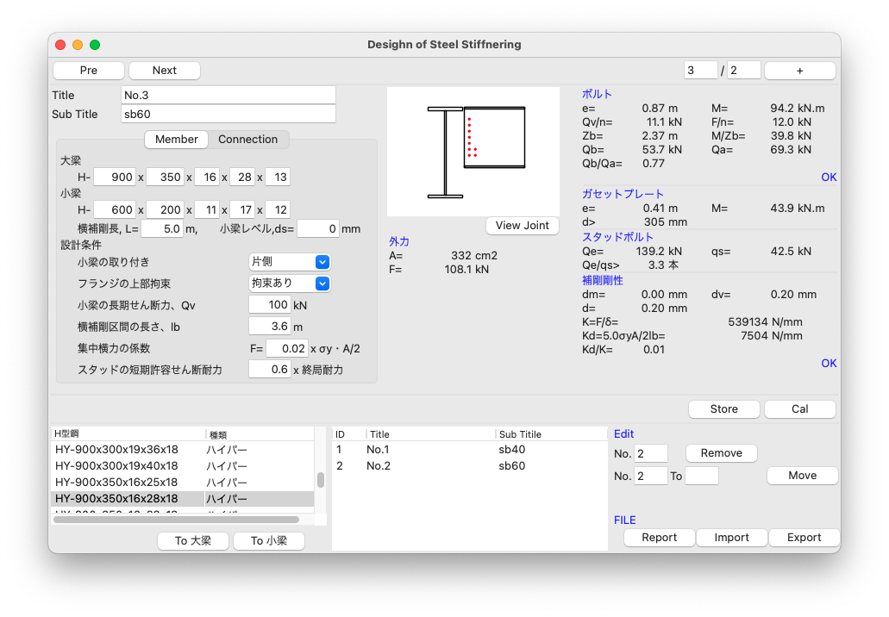
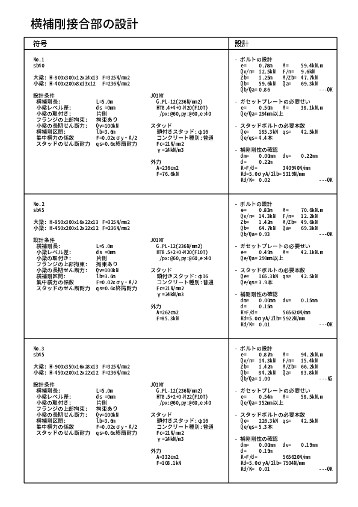

# Stiffner/横補剛接合部の設計

## GUI by wxpython


## Features
- Follow Japanese Code
- Calculate by Building letter
- Compute HTB shear force
- Import/Export by csv format
- Export pdf file report



## Develop Memo

## main.py
 Main Program

## stiffner.py
 Calculation of the joint between beam & sub beam

### how to
``` python
obj = Stiffner()
obj.solve(***)
```
### input parameter

### return

### example console output

## steel.py
### how to
### input
### return

## Module
- numpy
- sympy
- pandas
- reportlab

## report.py
use "./fonts/GenshinGothic-Monospace-Medium.ttf" for japanese
https://gammasoft.jp/blog/pdf-japanese-font-by-python/
``` python
self.FONT_NAME = "GenShinGothic"
GEN_SHIN_GOTHIC_MEDIUM_TTF = "./fonts/GenShinGothic-Monospace-Medium.ttf"
# フォント登録
pdfmetrics.registerFont(TTFont('GenShinGothic', GEN_SHIN_GOTHIC_MEDIUM_T
```

## Run
### For Mac & Linux
Download souse code, then,
``` shell
python3 ./main.py
```

### For Windows

By power shell
``` DOS
> pyinstaller main.py --onefile --noconsole --icon=icons/twoWay_Icon.ico
> mv ./images ./dist/main/
> mv ./fonts ./dist/main/
> ./dist/main/main.exe
```
or
``` DOS
> pyinstaller main.spec
> mv ./images ./dist/main/
> mv ./fonts ./dist/main/
> ./dist/main/main.exe
```

Check Release, and click main/rigidWink.exe!
